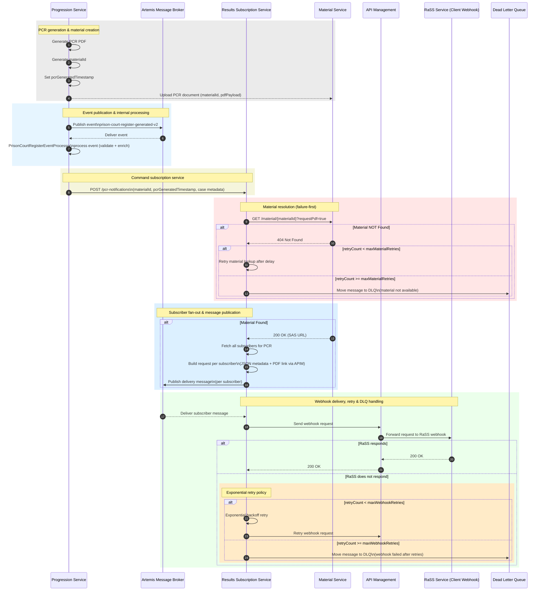

## Notifications

The PCR notification flow ensures that Prison Court Register (PCR) documents are reliably generated, published, and delivered to all subscribed downstream clients.

The Progression Service generates the PCR, stores the document, and publishes a PCR-generated event. After internal validation, it triggers the Results Subscription Service via http command.

The Results Subscription Service:
1.	Retrieves the PCR document securely using a time-limited SAS URL
1.	Resolves all registered subscribers
1.	Fans out delivery messages via Artemis
1.	Delivers notifications to client webhooks through API Management

The design is resilient and failure-aware:
1.	Material availability is checked before fan-out
1.	Each subscriber is handled independently
1.	Webhook failures are retried using exponential backoff
1.	Messages that exceed retry limits are sent to a Dead Letter Queue (DLQ)

This approach provides secure document access, isolated delivery per subscriber, and robust failure handling, while keeping services loosely coupled and scalable.

