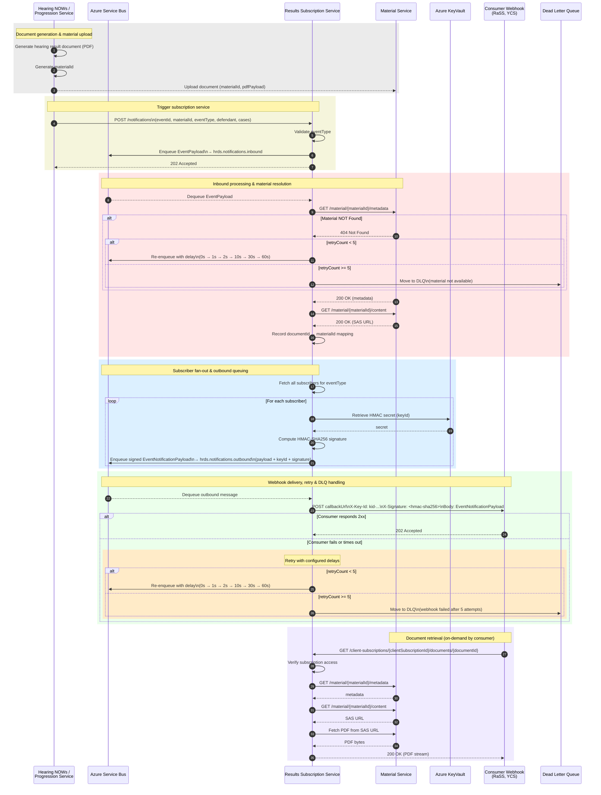

## Notifications

The notification flow ensures that hearing results documents are reliably generated, published, and delivered to all subscribed downstream clients.

The Hearing NOWs Service (or Progression Service for PCR events) uploads a document to the Material Service and then triggers the Results Subscription Service via `POST /notifications`. The service queues the event for asynchronous processing via Azure Service Bus.

The Results Subscription Service:
1. Validates the event type and enqueues the event on the **inbound processing queue** (`hrds.notifications.inbound`)
2. Dequeues and processes: fetches document metadata and a time-limited SAS URL from the Material Service, and records a `documentId` mapping
3. Resolves all registered subscribers for the given event type
4. For each subscriber, generates an HMAC-SHA256 signature and enqueues a delivery message on the **outbound delivery queue** (`hrds.notifications.outbound`)
5. Dequeues and delivers: sends a signed HTTP POST to each subscriber's callback URL

The design is resilient and failure-aware:
1. Material availability is checked before fan-out
2. Each subscriber is handled independently via separate outbound messages
3. Webhook failures are retried using configured delays (0 ms, 1 s, 2 s, 10 s, 30 s, 60 s) — up to 5 attempts total
4. Messages exceeding the retry limit are moved to the Azure Service Bus Dead Letter Queue (DLQ)

HMAC signing keys are issued per subscription at creation time and stored in **Azure KeyVault**. The raw secret is returned once in the creation response and cannot be retrieved again. The key ID is included in every webhook callback as `X-Key-Id` so subscribers can identify which key to use for signature verification. Secrets can be rotated via `POST /client-subscriptions/{clientSubscriptionId}/secret/rotate`.

Subscribers retrieve the delivered document via `GET /client-subscriptions/{clientSubscriptionId}/documents/{documentId}`. The service resolves the `documentId` to a `materialId`, fetches the document content from the Material Service, and streams the PDF to the caller.

```mermaid
sequenceDiagram
    autonumber

    participant HN as Hearing NOWs /<br/>Progression Service
    participant ASB as Azure Service Bus
    participant SUB as Results Subscription Service
    participant MS as Material Service
    participant KV as Azure KeyVault
    participant C as Consumer Webhook<br/>(RaSS, YCS)
    participant DLQ as Dead Letter Queue

    %% ===== DOCUMENT GENERATION =====
    rect rgb(235,235,235)
        Note over HN: Document generation & material upload
        HN->>HN: Generate hearing result document (PDF)
        HN->>HN: Generate materialId
        HN-->>MS: Upload document (materialId, pdfPayload)
    end

    %% ===== NOTIFICATION TRIGGER =====
    rect rgb(245,245,220)
        Note over HN,SUB: Trigger subscription service
        HN->>SUB: POST /notifications\n(eventId, materialId, eventType, defendant, cases)
        SUB->>SUB: Validate eventType
        SUB->>ASB: Enqueue EventPayload\n→ hrds.notifications.inbound
        SUB-->>HN: 202 Accepted
    end

    %% ===== INBOUND PROCESSING =====
    rect rgb(255,230,230)
        Note over ASB,MS: Inbound processing & material resolution
        ASB-->>SUB: Dequeue EventPayload

        SUB->>MS: GET /material/{materialId}/metadata
        alt Material NOT Found
            MS-->>SUB: 404 Not Found
            alt retryCount < 5
                SUB->>ASB: Re-enqueue with delay\n(0s → 1s → 2s → 10s → 30s → 60s)
            else retryCount >= 5
                SUB->>DLQ: Move to DLQ\n(material not available)
            end
        end

        MS-->>SUB: 200 OK (metadata)
        SUB->>MS: GET /material/{materialId}/content
        MS-->>SUB: 200 OK (SAS URL)
        SUB->>SUB: Record documentId → materialId mapping
    end

    %% ===== SUBSCRIBER FAN-OUT =====
    rect rgb(220,240,255)
        Note over SUB,ASB: Subscriber fan-out & outbound queuing
        SUB->>SUB: Fetch all subscribers for eventType
        loop For each subscriber
            SUB->>KV: Retrieve HMAC secret (keyId)
            KV-->>SUB: secret
            SUB->>SUB: Compute HMAC-SHA256 signature
            SUB->>ASB: Enqueue signed EventNotificationPayload\n→ hrds.notifications.outbound\n(payload + keyId + signature)
        end
    end

    %% ===== WEBHOOK DELIVERY & RETRY =====
    rect rgb(235,255,235)
        Note over ASB,C: Webhook delivery, retry & DLQ handling
        ASB-->>SUB: Dequeue outbound message
        SUB->>C: POST callbackUrl\nX-Key-Id: kid-...\nX-Signature: <hmac-sha256>\nBody: EventNotificationPayload

        alt Consumer responds 2xx
            C-->>SUB: 202 Accepted
        else Consumer fails or times out
            rect rgb(255,235,200)
                Note over SUB: Retry with configured delays
                alt retryCount < 5
                    SUB->>ASB: Re-enqueue with delay\n(0s → 1s → 2s → 10s → 30s → 60s)
                else retryCount >= 5
                    SUB->>DLQ: Move to DLQ\n(webhook failed after 5 attempts)
                end
            end
        end
    end

    %% ===== DOCUMENT RETRIEVAL =====
    rect rgb(240,235,255)
        Note over C,MS: Document retrieval (on-demand by consumer)
        C->>SUB: GET /client-subscriptions/{clientSubscriptionId}/documents/{documentId}
        SUB->>SUB: Verify subscription access
        SUB->>MS: GET /material/{materialId}/metadata
        MS-->>SUB: metadata
        SUB->>MS: GET /material/{materialId}/content
        MS-->>SUB: SAS URL
        SUB->>MS: Fetch PDF from SAS URL
        MS-->>SUB: PDF bytes
        SUB-->>C: 200 OK (PDF stream)
    end
```
