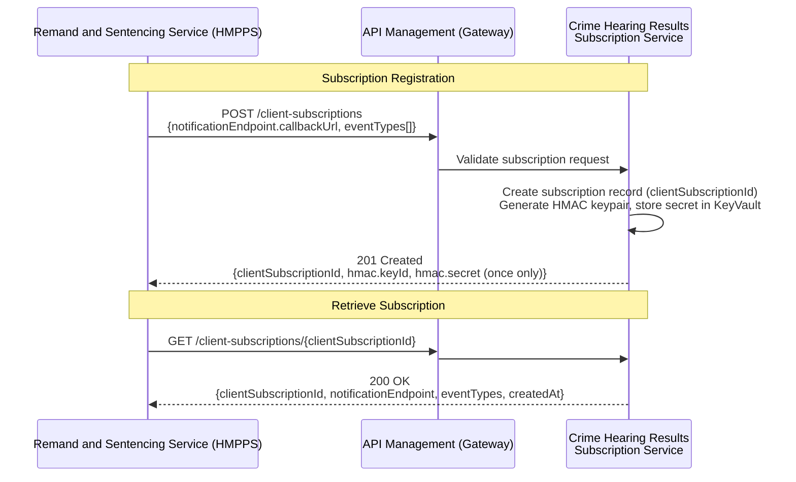
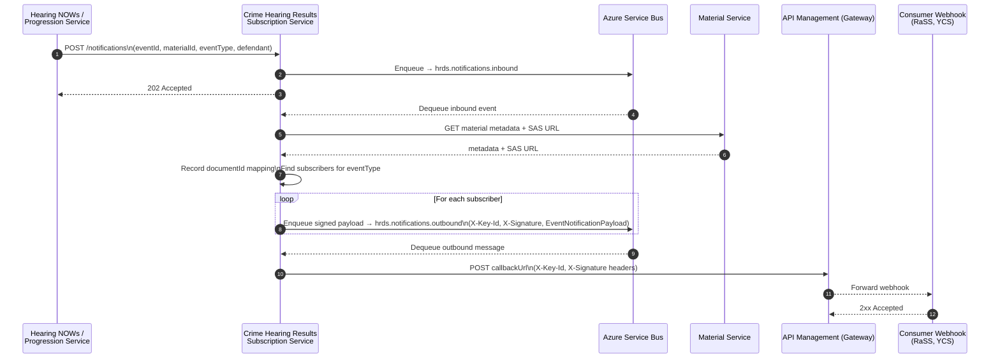
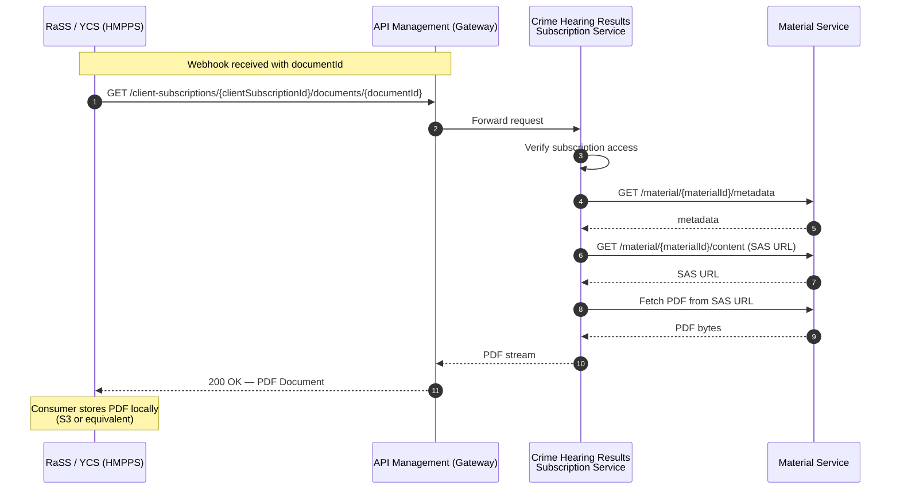
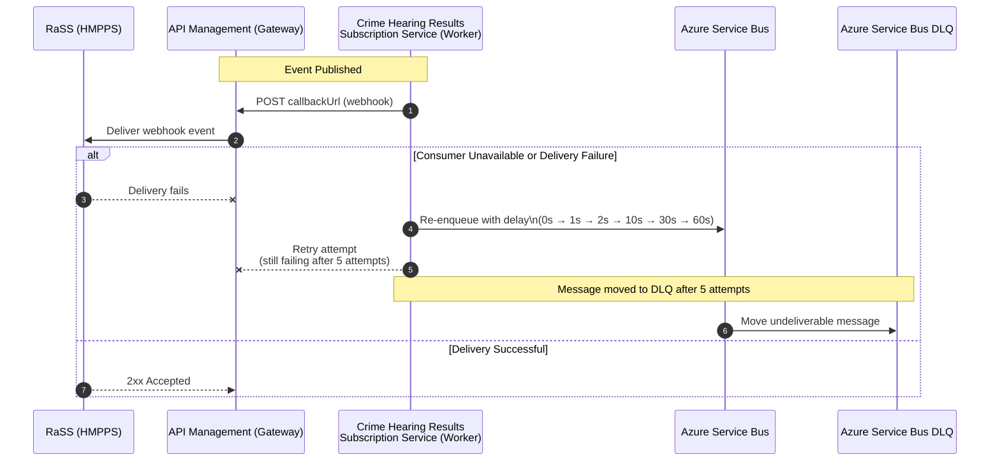

# Criminal Court Result Subscription API – Functional Requirements (Draft)

Producer: HMCTS Common Platform

Consumer: **Initial** consumer Remand and Sentence Service (RaSS)

Version: Draft 0.1

Status: For discussion

## Purpose of the API

The Criminal Courts (Magistrate and Crown) Result Subscription API provides a standardised, reusable mechanism for HMCTS
to publish custody-relevant case result events to authorised justice partners.

While the initial consumer is the Prisons Remand and Sentencing Service (RaSS), the API is intentionally designed as a
multi-consumer event distribution pattern that can support wider cross-justice needs (e.g. DWP, Probation, Police, Victims Services).

The API enables:
* Event-based notifications when HMCTS records or amends a custody-impacting court result.
* Structured metadata describing the event so consumers can automate workflow decisions.
* A consistent document access model, providing a URL for retrieving the current source-of-truth court documents (e.g. PDF warrants, in early phases).
* A scalable subscription model that aligns with the HMCTS API Marketplace, allowing future consumers to onboard without bespoke integrations.

### Initial Use Case: RaSS Warrant Ingestion

The initial use case for this API is to support RaSS in automating the ingestion of custodial warrants and sentencing documents from HMCTS.

This work replaces part of the existing email-based warrant distribution process — which contributes to operational errors,
including Releases in Error — and provides a modern, event-driven foundation for safer and more consistent data sharing between courts and prisons.

Email delivery will run in parallel during early adoption to minimise operational risk during transition.

## Event-Based Subscription and Publishing Model

The API must support a subscription-based event model where consumers can register to receive custody-relevant result events via webhooks.

HMCTS must publish result events whenever:
* A new custodial outcome occurs.
* An amended custodial result is recorded (treated identically to “create”).

### Subscription Registration

`POST /client-subscriptions`

```json
{
    "notificationEndpoint": {
      "callbackUrl": "https://consumer.gov.uk/hooks/case-events"
    },
    "eventTypes": ["PRISON_COURT_REGISTER_GENERATED"]
}
```

Response (201 Created):
```json
{
  "clientSubscriptionId": "{UUID}",
  "notificationEndpoint": {
    "callbackUrl": "https://consumer.gov.uk/hooks/case-events"
  },
  "eventTypes": ["PRISON_COURT_REGISTER_GENERATED"],
  "hmac": {
    "keyId": "kid-v1-{UUID}",
    "secret": "<base64-encoded-secret — returned once, cannot be retrieved again>"
  },
  "createdAt": "2025-01-01T10:00:00Z"
}
```

(TBC) Event Payload Must Include:
* Case ID
* Defendant ID
* PNC ID (if present)
* Event timestamp
* Custody relevance flag
* Metadata describing the result/warrant

These events will ultimately replace the existing email “action point”.

### Webhook Delivery Requirements

* Consumer must provide HTTPS POST endpoint (no HTTP).
* Service signs every webhook delivery with HMAC-SHA256. Each request includes `X-Key-Id` (key identifier) and `X-Signature` (base64-encoded HMAC). The secret is issued once at subscription creation and stored in Azure KeyVault; it can be rotated via `POST /client-subscriptions/{clientSubscriptionId}/secret/rotate`.
* Consumer must return 2xx to acknowledge.
* Retries managed by Worker with configured delays: 0 ms, 1 s, 2 s, 10 s, 30 s, 60 s — up to 5 attempts total.
* Failures exceeding retry limit are routed to Azure Service Bus Dead Letter Queue (DLQ).

#### Sequence Diagrams: Subscription Registration and Retrieval



## Subscription Event Delivery & Document Retrieval



## Authentication

### API Authentication

All API requests require authentication using OAuth 2.0 client credentials flow:

1. **Client Registration**: Common Platform registers the consumer application (e.g., RaSS) in Microsoft Entra ID and provides the client ID and secret
2. **Token Acquisition**: Clients obtain an access token from Common Platform Microsoft Entra ID using their client ID and secret
3. **Token Usage**: Include the access token in the `Authorization` header as a Bearer token
4. **Token Refresh**: Tokens have a limited lifetime; clients must refresh before expiry

### Token Validation

API Management (Gateway) validates all incoming tokens using the built-in `validate-jwt` policy before forwarding requests to backend services. Validation is performed locally using cached public keys from Microsoft Entra ID (JWKS endpoint):

1. **Signature Verification**: Validates the token signature against cached Microsoft Entra ID public keys
2. **Expiry Check**: Rejects expired tokens (validates `exp` claim)
3. **Issuer Validation**: Confirms the `iss` claim matches Common Platform Microsoft Entra ID tenant
4. **Audience Validation**: Confirms the `aud` claim matches this API's application ID

Invalid tokens are rejected with HTTP 401 Unauthorized.

**APIM Policy Example:**
```xml
<inbound>
    <validate-jwt header-name="Authorization" failed-validation-httpcode="401">
        <openid-config url="https://login.microsoftonline.com/{tenant-id}/v2.0/.well-known/openid-configuration" />
        <audiences>
            <audience>{api-application-id}</audience>
        </audiences>
        <issuers>
            <issuer>https://login.microsoftonline.com/{tenant-id}/v2.0</issuer>
        </issuers>
    </validate-jwt>
</inbound>
```

### Webhook Authentication

When delivering events to consumer webhook endpoints, the service authenticates each callback using **HMAC-SHA256 signing**:

1. At subscription creation, the service generates an HMAC keypair and returns the secret once in the response body. The secret is stored in Azure KeyVault and cannot be retrieved again via the API.
2. On each webhook delivery, the service retrieves the secret from KeyVault, signs the `EventNotificationPayload` JSON body, and includes the result in the request headers:
   - `X-Key-Id` — identifies which key was used (allows consumers to handle key rotation)
   - `X-Signature` — base64-encoded HMAC-SHA256 of the request body

Consumers verify the signature using the shared secret to confirm the webhook originated from HMCTS.

Secrets can be rotated via `POST /client-subscriptions/{clientSubscriptionId}/secret/rotate`. The new secret is returned once and the old key is deactivated.

**Security Requirements:**
- All webhook URLs must use HTTPS (`^https://.*$`); HTTP is rejected at subscription creation
- Credentials stored in Azure KeyVault
- Rotate secrets periodically via the rotation endpoint
- Log authentication failures for security monitoring

### Document Retrieval Process

After receiving a webhook event containing `documentId`, the consumer retrieves the document via:

`GET /client-subscriptions/{clientSubscriptionId}/documents/{documentId}`

The service verifies the subscription has access to that document, fetches the content from the Material Service, and streams the PDF to the caller.



**Important Note:**
The PDF remains the operational currency today.
Until the operational process changes, this must remain part of the producer–consumer relationship.

#### Document Retrieval Requirements

* Documents must not be embedded in any JSON event payload.
* API provides a streaming endpoint for document retrieval: `GET /client-subscriptions/{clientSubscriptionId}/documents/{documentId}`
* Material Service (HMCTS document storage) remains the source of truth; the service proxies requests using time-limited SAS URLs.
* Consumers may store a local copy to support their workflow automation.

**Benefits**

* Digital transfer supports prisoner movement between establishments.
* Reduces repeated document requests to HMCTS.
* Provides traceability and reduces “missing document” incidents.

### Reliability & Failure Handling

The existing email process offers no delivery guarantee.

The API must support:

Delivery Guarantees
* Retry with exponential backoff
* Dead-letter queue (DLQ) for undeliverable events
* Ability for consumers to inspect DLQs
* Ability for consumers to replay DLQs once systems recover



## Event Filtering Requirements

RaSS must only receive events relevant to custodial processing.

Event Types the API Should Support:
* Custodial outcomes
* Bail from custody
* Events that change a prisoner’s legal status

Events RaSS does NOT want:
* Full case data
* All court events
* Civil or non-custodial results

The API must surface only custody-impacting result events.

## Requirements for Updates / Amendments

API Requirements
* Every amendment must generate a new event
* Updates treated the same as creates (idempotent notification model)
* The API must always allow retrieval of the latest document version

## Security Requirements

The new system must:
* Use secure authentication (OAuth2 preferred long-term)
* Provide authenticated document streaming API (no signed URLs)
* Enforce strong audit trails and access controls
* Never embed PDFs directly in event payloads
* Ensure privacy and integrity of custody-related data

## Additional Future Considerations

* Discoverable list of event types: GET /event-types (implemented)
* Potential expansion to other justice partners (DWP, Probation)
* Multi-consumer patterns enabled via API Marketplace

## Next Steps

* Align subscription model with API Marketplace standards
* Define authentication model for all consumer but initially for RaSS (temporary → long-term OAuth2)
* Produce OpenAPI v1.0 draft
  * Including event schema for MVP


